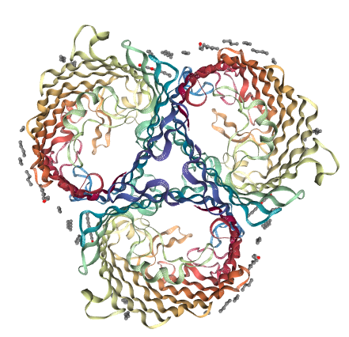

# ProtienDS-Portfolio

## Proteins Research Analysis and Visualization
This repository contains Jupyter notebooks and data that showcases various analyses and visualizations related to protein research. It serves as a portfolio demonstrating skills in data science, statistical modeling, and biological data interpretation, particularly in the context of protein engineering.

## Project Overview
This repository features interactive analyses designed to illustrate how data science methodologies can be applied to complex biological data, specifically focusing on protein primary structures and their properties. The notebooks explore simulated experimental data, perform statistical tests, build machine learning models, and create insightful visualizations to guide protein engineering efforts.

## Key Features & Analyses Demonstrated

* **Protein Variant Property Analysis:**

    * **Data Generation:** Utilizes a generative AI model (LLM, Gemini Flash 2.5) to create hypothetical protein variants, including a simulated `Mutational_Effect_Score` and `Mutation_Count`. This data is then enriched with simulated experimental measurements for `Expression_Level` and `Stability_Score`, and a categorical `Immunogenicity_Prediction`.

    * **Exploratory Data Analysis (EDA):** Provides initial data snapshots, descriptive statistics, and visualizations to understand the dataset's characteristics.

    * **Visualizations:**

        * Scatter plot of `Stability_Score` versus `Mutational_Effect_Score`, colored by `Immunogenicity_Prediction` and sized by `Mutation_Count`, to explore multivariate relationships.

        * Histogram illustrating the distribution of simulated `Stability_Score` values.

    * **Machine Learning Model:** Develops a regression model using `RandomForestRegressor` to predict `Stability_Score` based on features including `Mutation_Count`, `Mutational_Effect_Score`, `Expression_Level`, and one-hot encoded `Immunogenicity_Prediction`.

    * **Model Evaluation & Interpretation:** Reports Mean Absolute Error (MAE) and R-squared (R2) for model performance, and visualizes actual vs. predicted scores and feature importances to understand which factors drive protein stability.

* **Interactive 3D Protein Visualization and Statistical Comparison of B-factors between Secondary Strucrures:**

    * **Downloading and parsing protein structure files (PDB format).**

    * **Interactive 3D rendering of protein structures using NGLView.**

    * **Extraction and 2D visualization of structural properties like B-factors (flexibility) using Matplotlib and Seaborn.**

    * **Statistical comparison of B-factors across different secondary structure elements.**
 
  **Example: Green Fluorescent Protein (PDB ID: 1GFP)**
  
  *A static rendering of the 3D structure of Green Fluorescent Protein (PDB ID: 1GFP), visualized using NGLView.*

## How to Use This Repository

To explore the analyses in this repository:

1.  **Clone the Repository:**

    ```bash
    git clone [Your GitHub Repository URL Here]
    cd [your-repo-name]
    ```

2.  **Create a Virtual Environment (Recommended):**

    ```bash
    python -m venv venv
    source venv/bin/activate  # On Windows: `venv\Scripts\activate`
    ```

3.  **Install Dependencies:**

    ```bash
    pip install pandas numpy matplotlib seaborn scikit-learn scipy requests
    ```

4.  **Launch Jupyter Notebook/Lab:**

    ```bash
    jupyter notebook
    # or
    jupyter lab
    ```

5.  **Open and Run Notebooks:** Navigate to the `.ipynb` files in the repository and run the cells sequentially to see the analyses and visualizations.

## Data

The data used in the **Protein Variant Property Analysis** notebook is **synthetically generated**, partially using a generative AI model to simulate hypothetical protein variants and their predicted mutational effects, and further enriched with simulated experimental measurements. This allows for a self-contained demonstration of the analytical pipeline.

## Technologies Used

* **Python:** Core programming language
* **Jupyter Notebook:** Interactive development environment
* **Pandas:** Data manipulation and analysis
* **NumPy:** Numerical computing
* **Scikit-learn:** Machine learning models
* **SciPy:** Scientific computing and statistical tests
* **Matplotlib:** Basic plotting
* **Seaborn:** Statistical data visualization
* **Requests:** Making HTTP requests (e.g., for interacting with generative AI)
* **Git:** Version control


